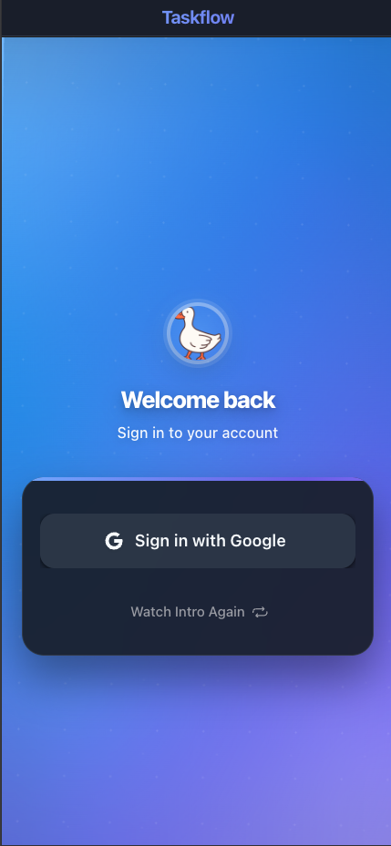
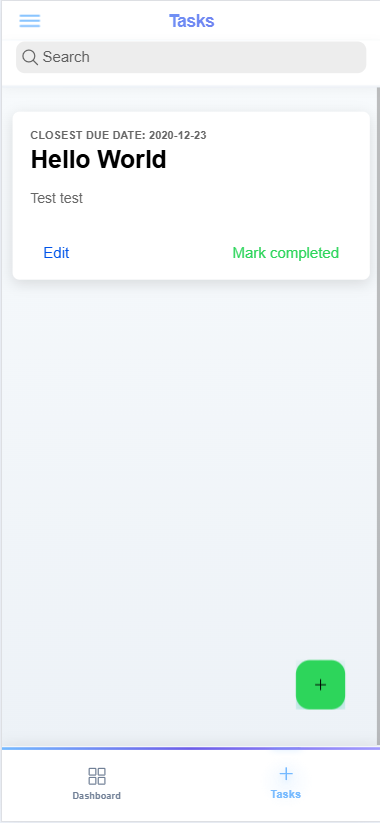
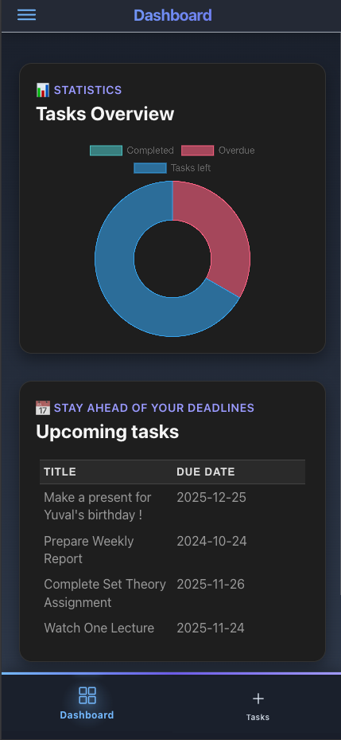

# 🧭 TaskFlow Mobile

A modern, mobile-first task management application built with React, Ionic, and Capacitor for seamless iOS and Android experiences.

---

## 🎬 Preview

### ✨ Experience TaskFlow in Action

**▶️ Click to watch demo on YouTube**

### 📸 Screenshot Gallery

| Login Screen | Task Management | Dashboard |
|:---:|:---:|:---:|
|  |  |  |
| Secure Authentication | Intuitive Organization | Quick Overview |

---

## 📱 What is TaskFlow?

TaskFlow is a **mobile-first task management application** designed to help you organize, track, and complete your tasks efficiently. Built with modern web technologies and compiled to native mobile apps, TaskFlow offers a seamless experience across iOS and Android devices.

### ✨ Key Highlights

- **Mobile-First Design** - Optimized for touch interactions and mobile workflows
- **Native Performance** - Compiled to native iOS and Android apps using Capacitor
- **Modern Stack** - React + Ionic + TypeScript for maintainable, scalable code
- **Google OAuth Integration** - Quick and secure authentication
- **Beautiful Dark Mode** - Arctic blue theme with smooth animations
- **Smooth Interactions** - Delightful micro-interactions throughout

---

## 🎯 Features

- 🔐 **Secure Authentication** - Google OAuth via Capacitor
- 📋 **Intuitive Task Lists** - Swipe, tap, and organize with ease
- 🎨 **Modern Arctic Blue Theme** - Beautiful gradient designs with dark mode support
- ⚡ **Smooth Animations** - Delightful micro-interactions
- 📱 **Native Feel** - Optimized for iOS and Android
- 🌍 **Cross-Platform** - Single codebase for web and mobile

---

## 🚧 Development Status

This project is currently under active development.

### ✅ Completed

- Project setup and configuration
- Mobile-optimized UI framework
- Development environment
- Basic navigation structure
- User authentication flow (Google OAuth via Capacitor)

### 🔄 In Progress

- Local authentication
- Task CRUD operations
- Mobile-specific optimizations

### 📋 Roadmap

- iOS App Store deployment
- Android Play Store deployment
- Offline synchronization
- Push notifications
- Advanced task organization
- Web version (future consideration)

---

## 🏗️ Architecture

TaskFlow follows a **client-server architecture** with separate frontend and backend repositories:

    📱 Mobile App                🔄 API Calls              🖥️ Backend Server
    ┌──────────────────┐         ──────────────►      ┌──────────────────┐
    │                  │                              │                  │
    │ React + Ionic    │         ◄──────────────      │  TaskFlow API    │
    │ (frontend)       │           JSON Data          │   (backend)      │
    │                  │                              │                  │
    └──────────────────┘                              └──────────────────┘
            │                                                   │
            │ Capacitor                                         │ Database
            ▼                                                   ▼
    ┌──────────────────┐                              ┌──────────────────┐
    │                  │                              │                  │
    │  Native Apps     │                              │   PostgreSQL /   │
    │ (iOS/Android)    │                              │      MySQL       │
    │                  │                              │                  │
    └──────────────────┘                              └──────────────────┘

### 📦 Required Repositories

| Repository | Role | Link |
|-----------|------|------|
| **taskflow-frontend** | Mobile Frontend | [MrSSHH/taskflow-frontend](https://github.com/MrSSHH/taskflow-frontend) |
| **taskflow-api** | Backend API | [MrSSHH/taskflow-api](https://github.com/MrSSHH/taskflow-api) |

⚠️ **IMPORTANT**: The TaskFlow API backend must be running before using this frontend application.

---

## ⚡ Quick Start

### 🛠️ Prerequisites

- **Node.js** v18 or higher
- **npm** or **yarn**
- **Git**
- **Mobile development tools** (Xcode for iOS, Android Studio for Android)

### 🚀 Setup Instructions

#### Step 1: Set Up the Backend API First

    git clone https://github.com/MrSSHH/taskflow-api.git
    cd taskflow-api

Follow the setup instructions in the taskflow-api repository. Ensure the API server is running before proceeding.

#### Step 2: Set Up the Frontend

    git clone https://github.com/MrSSHH/taskflow-frontend.git
    cd taskflow-frontend
    npm install
    cp .env.example .env.local

#### Step 3: Configure Environment Variables

Edit `.env.local`:

    VITE_API_BASE_URL=http://localhost:3001
    VITE_API_VERSION=v1
    VITE_APP_NAME=TaskFlow
    VITE_APP_VERSION=1.0.0

#### Step 4: Start Development

    npm run dev

### 📱 Mobile Development

#### 🍎 iOS

    npm run build
    npx cap add ios
    npx cap open ios

**Requirements**: macOS, Xcode (latest), iOS Simulator or device

#### 🤖 Android

    npm run build
    npx cap add android
    npx cap open android

**Requirements**: Android Studio, Android SDK, AVD or device

---

## 🛠️ Tech Stack

| Technology | Version | Purpose |
|-----------|---------|---------|
| **React** | 18+ | UI framework and component management |
| **Ionic** | 7+ | Mobile-optimized UI components |
| **Capacitor** | 5+ | Native mobile app compilation |
| **TypeScript** | 5+ | Type-safe JavaScript development |
| **Vite** | Latest | Fast build tool and dev server |

### Mobile Capabilities

- 📱 Native device APIs (camera, notifications, file system)
- 🔄 Background synchronization
- 📧 Push notifications for task reminders

---

## 📁 Project Structure

    taskflow-frontend/
    ├── public/                 # Static assets
    ├── src/
    │   ├── components/        # Reusable UI components
    │   ├── pages/            # Application pages/screens
    │   ├── hooks/            # Custom React hooks
    │   ├── services/         # API services and utilities
    │   ├── store/            # Redux store configuration
    │   ├── types/            # TypeScript type definitions
    │   ├── utils/            # Helper functions
    │   └── App.tsx           # Root application component
    ├── ios/                   # iOS-specific files (Capacitor)
    ├── android/               # Android-specific files (Capacitor)
    ├── docs/                  # Documentation and screenshots
    ├── capacitor.config.ts   # Capacitor configuration
    └── package.json          # Project dependencies and scripts

---

## 📜 Available Scripts

| Script | Description |
|--------|-------------|
| `npm run dev` | Start development server |
| `npm run build` | Build for production |
| `npm run preview` | Preview production build |
| `npm run lint` | Run ESLint |
| `npm run type-check` | Run TypeScript checks |
| `npm run test` | Run test suite |
| `npm run ionic:serve` | Start Ionic dev server |
| `npm run ionic:build` | Build with Ionic CLI |

---

## 🤝 Contributing

We welcome contributions to TaskFlow! This project is in early development with many opportunities to help.

### 🎯 Areas Where We Need Help

- 📱 Mobile UI/UX design
- ⚡ Performance optimization
- 🔄 API integration
- 🧪 Testing (unit, integration, mobile)
- 📚 Documentation
- 🔐 Mobile app security
- 🌐 Accessibility

### 🚀 Getting Started

1. Check the issues for "good first issue" labels
2. Follow the setup instructions above
3. Ensure both frontend and API are running
4. Fork the repository
5. Create a feature branch: `git checkout -b feature/your-feature`
6. Test changes on iOS and Android if possible
7. Submit a pull request

### 📋 Development Guidelines

- Use TypeScript for all new code
- Follow existing code style and patterns
- Test on both iOS and Android
- Write meaningful commit messages
- Update documentation for new features

---

## 📋 Troubleshooting

### Common Issues

**Frontend won't start**
- Ensure the TaskFlow API is running first
- Check `.env.local` has the correct API URL
- Verify Node.js version (v18+)

**Mobile build fails**
- Ensure latest Xcode (iOS) or Android Studio (Android)
- Run `npx cap sync` after changes
- Verify all dependencies are installed

**API connection errors**
- Verify API server is running on the correct port
- Check firewall settings
- Ensure API URL in `.env.local` matches your backend setup

### Getting Help

- 💬 GitHub Discussions
- 🐛 Issue Tracker
- 📖 [TaskFlow API Documentation](https://github.com/MrSSHH/taskflow-api)

---

## 📄 License

This project is licensed under the MIT License - see the [LICENSE](LICENSE) file for details.

---

## 👨‍💻 Author

**MrSSHH**

- GitHub: [@MrSSHH](https://github.com/MrSSHH)
- Related: [TaskFlow API](https://github.com/MrSSHH/taskflow-api)

---

## 🙏 Acknowledgments

Special thanks to:

- [Ionic Team](https://ionicframework.com/) - Amazing mobile framework
- [Capacitor Team](https://capacitorjs.com/) - Seamless native integration
- [React Team](https://reactjs.org/) - Powerful UI framework
- Open-source community - Inspiration and contributions

---

⭐ Star this repo if you find it useful!

Built with ❤️ for mobile productivity
